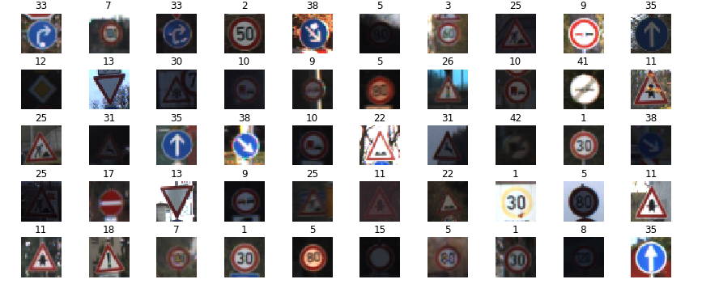

# Self_Driving_Car_Nano_degree Projects
# Projects:
# 1. Lane Line Detection in the Road: Directory - "CarND-LaneLines-P1-master"

# 2. CNN based Traffic Sign Classifier which automatically identifies 43 traffic sign images

Validation Results with VGGNet19:

Evaluation on Validation dataset :
Loss = 0.024464540795306938 
Validation Accuracy = 0.9925533000102009 
F1 Score = 0.8612856388226784
Recall score = 0.8589207385494236

Evaluation on test dataset: 
Loss = 0.5035534291040948
Test Accuracy = 0.9016627078479184
F1 Score = 0.7763211212494087 
Recall score = 0.7756927949326999

